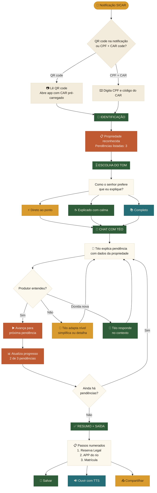

# ExpliCAR — Plano de Demonstração
## Desafio 3: Aumentar o entendimento das Legislações do CAR

---

## 1. Jornada do Usuário (fluxo completo da demonstração)




---

## 2. Funcionalidades do MVP (o que vamos demonstrar)

### 2.1 Chat com Téo (coração da solução)

**O que é:** Chat conversacional onde Téo explica cada pendência do CAR usando a persona adaptativa.

**Como demonstra:**
- O produtor chega e vê as pendências listadas
- Téo explica a primeira pendência no tom escolhido
- O produtor pode responder "não entendi" → Téo simplifica automaticamente
- O produtor pode pedir "quero entender melhor" → Téo detalha

**O que mostra ao avaliador:**
- A adaptação de linguagem em tempo real (3 níveis)
- O uso do nome da propriedade e dados reais
- A estrutura: O que significa → Por que aconteceu → O que fazer

### 2.2 Gamificação (progresso visual)

**O que é:** Indicador "Você já resolveu 1 de 3 pendências" visível durante todo o chat.

**Como demonstra:**
```
 ┌──────────────────────────┐
 │  Pendências do seu CAR   │
 │                          │
 │  [✔] APP do riacho Seco  │
 │  [ ] Reserva Legal       │ ◄─ atual
 │  [ ] Matrícula no       │
 │      cartório            │
 │                          │
 │     ▓▓▓░░░  1 de 3      │
 └──────────────────────────┘
```

**O que mostra ao avaliador:**
- Redução da ansiedade (produtor vê que está avançando)
- Clareza sobre o que falta fazer
- Sensação de progresso e conclusão

### 2.3 Suporte a Áudio (TTS)

**O que é:** Botão "Ouvir" em cada explicação — o produtor pode escutar em vez de ler.

**Como demonstra:**
- Cada resposta de Téo tem um ícone de alto-falante 🔊
- Ao clicar, um TTS (OmniVoice processado no servidor) lê a mensagem em voz alta
- Destaque visual do texto sendo lido (palavra a palavra ou sentença)

**Stack:** OmniVoice TTS (k2-fsa, Apache 2.0, 646 línguas, 40× tempo real, auto-hospedado em GPU ou CPU)

**O que mostra ao avaliador:**
- Acessibilidade para produtores com baixa alfabetização
- TTS processado no servidor, sem API externa
- Replicação do atendimento oral do mutirão

### 2.4 FAQ Contextual

**O que é:** Durante o chat, Téo reconhece perguntas frequentes e responde rápido — mesmo com erros de digitação.

**Como demonstra:**
```
 Produtor: "o q é app"
 Téo: "APP é a Área de Preservação Permanente — a mata
        que a lei manda manter na beira dos rios. No seu
        caso, o Riacho Seco precisa de 30 metros de cada
        lado com vegetação."

 Produtor: "reserva legal oq é"
 Téo: "Reserva Legal é a parte da sua terra que precisa
        ficar com vegetação nativa. No Cerrado, são 20%
        da propriedade."
```

**Tolerância a erros:** Usa fuzzy matching (ex: "resrva" → "reserva", "app" → "APP")

**O que mostra ao avaliador:**
- Produtor não precisa digitar perfeitamente (muitos têm dificuldade com tecnologia)
- FAQ integrado ao chat, não uma tela separada
- Reduz a carga do LLM para perguntas comuns (respostas pré-definidas com fallback para LLM)

### 2.5 Resumo Legal Personalizado (substitui a calculadora)

**O que é:** Em vez de uma calculadora genérica onde o produtor digita área e bioma, Téo gera automaticamente um resumo legal personalizado usando os dados reais do CAR da propriedade.

**Por que substitui a calculadora:**
- O sistema já conhece a área, bioma e dados do imóvel — não faz sentido o produtor digitar
- A legislação real tem regras condicionais encadeadas (ZEE, módulos fiscais, marco 2008) que uma calculadora simples não captura
- O que o produtor precisa é de explicação contextual, não de um número solto

**Como demonstra:**
```
Téo: "Seu Raimundo, o Sítio Boa Esperança tem 85 hectares
      e fica na Amazônia Legal. Pela lei, a Reserva Legal
      precisaria ser de 80% — 68 hectares. Mas o Pará tem
      Zoneamento Ecológico-Econômico e sua área está em
      zona de consolidação, então cai para 50%. E como
      a propriedade tem menos de 4 módulos fiscais, o
      senhor pode manter como RL a vegetação nativa que
      já existia em julho de 2008."
```

**O que mostra ao avaliador:**
- Personalização real com dados da propriedade
- Aplica regras legais na ordem correta (bioma → ZEE → módulos fiscais → marco 2008)
- Transforma legislação complexa em uma explicação clara e encadeada

---

## 3. Arquitetura (100% opensource)

```
┌──────────────────────────────────────────────┐
│             FRONTEND (PWA em React)           │
│  • Mobile-first, responsivo                   │
  │  • Design responsivo mobile-first             │
│  • ARIA labels + contraste WCAG (preparação)  │
│  • reprodução de áudio com OmniVoice TTS          │
└────────────────┬─────────────────────────────┘
                 │ HTTPS
┌────────────────▼─────────────────────────────┐
│           BACKEND (Python / FastAPI)           │
│                                                │
│  ┌──────────┐ ┌──────────┐ ┌──────────────┐ │
│  │ Chat     │ │ FAQ      │ │ Gamificação  │ │
│  │ endpoint │ │ endpoint │ │ (progresso)  │ │
│  └────┬─────┘ └────┬─────┘ └──────┬───────┘ │
│       │            │              │          │
│  ┌────▼────────────▼──────────────▼───────┐ │
│  │        Orchestrador de Persona         │ │
│  │  • Seleciona nível (Direto ao ponto,   │ │
│  │    Explicado com calma, Completo)      │ │
│  │  • Aplica regras da persona Téo       │ │
│  │  • Monta prompt com dados do produtor  │ │
│  └────────────────┬───────────────────────┘ │
└───────────────────┼─────────────────────────┘
                    │
┌───────────────────▼─────────────────────────┐
│          LLM (modelo agnóstico)              │
│  • Pode ser Llama 3 / Mistral / Qwen        │
│  • A persona (prompt) dita o comportamento  │
  │  • Inferência auto-hospedada via vLLM ou Ollama      │
└───────────────────┬─────────────────────────┘
                    │
┌───────────────────▼─────────────────────────┐
│          SICAR Adapter (mock → real)        │
│  • Interface padronizada de consulta        │
│  • Mock com dados de exemplo para demo      │
│  • Pronto para conectar na API do SICAR     │
└─────────────────────────────────────────────┘

┌─────────────────────────────────────────────┐
│              BANCO DE DADOS                  │
│  PostgreSQL                                  │
│  • Usuários e propriedades                   │
│  • Histórico de conversas                    │
│  • Progresso das pendências                  │
└─────────────────────────────────────────────┘
```

### Stack completa

| Camada | Tecnologia | Licença |
|---|---|---|
| Frontend | React + Vite + PWA | MIT |
| Backend | Python + FastAPI + Uvicorn | MIT |
| LLM Inference | vLLM ou Ollama | Apache 2.0 / MIT |
| Modelo | Llama 3 / Mistral / Qwen (qualquer) | Apache 2.0 / CC-BY |
| TTS | OmniVoice | Apache 2.0 |
| Database | PostgreSQL | PostgreSQL |
| Cache | Redis (opcional) | BSD |
| Container | Docker + Docker Compose | Apache 2.0 |

---

## 4. Mapeamento: ExpliCAR × Critérios do Desafio 3

| O que o Desafio 3 pede | Como o ExpliCAR entrega | Onde na demo |
|---|---|---|
| Simplificação de linguagem | Persona Téo com 3 níveis adaptativos + tradução de siglas | Chat + escolha de tom |
| Educação e engajamento | Gamificação mostra progresso, reduz ansiedade | Barra de progresso "1 de 3" |
| Suporte aos analistas | Mesma ferramenta que o produtor usa pode ser usada no atendimento presencial | (Contexto do pitch) |
| Tradução do código florestal | Base de conhecimento integrada à persona + FAQ contextual | Chat + FAQ |
| Análise automatizada | LLM interpreta a pendência e gera explicação personalizada com dados do imóvel | Chat |
| Plataforma de comunicação | PWA acessível via celular, com áudio para quem não lê | TTS + áudio |
| Formação de multiplicadores | (Pós-MVP) Perfil técnico para extensionistas usarem como roteiro de atendimento | Roadmap |

---

## 5. Roteiro da Demonstração (para apresentar aos avaliadores)

### Cena 1 — O Problema (30s)
> "Seu Raimundo recebe uma notificação do SICAR. São 3 páginas com siglas, artigos de lei e termos que ele nunca ouviu falar. Ele não sabe se é multa, não sabe o que fazer, e o cadastro fica parado."

### Cena 2 — A Entrada (30s)
> "Ele aponta o celular para o QR code que veio na notificação. Ou digita o CPF e o código do CAR. O sistema reconhece ele e a propriedade."

### Cena 3 — A Escolha (20s)
> "Téo pergunta: 'Como o senhor prefere que eu explique?' Seu Raimundo escolhe 'Explicado com calma'."

### Cena 4 — O Chat (60s)
> "Téo explica a primeira pendência. Seu Raimundo franze a testa. Téo percebe e simplifica. Depois ele pergunta 'e a reserva legal?' — Téo responde com mais detalhe. A barra mostra: 1 de 3 resolvidas."

### Cena 5 — O Áudio (20s)
> "Seu Raimundo não enxerga bem. Ele clica no alto-falante e Téo lê a explicação em voz alta."

### Cena 6 — A Saída (20s)
> "Ao final, Téo mostra os 3 passos numerados. Seu Raimundo salva e compartilha com o filho no WhatsApp. Sabe exatamente o que fazer."

### Encerramento (20s)
> "O que resolveu em 20 minutos de mutirão agora cabe no bolso do seu Raimundo. Sem sair de casa. Sem juridiquês. E funciona online."

---

## 6. Roadmap (além do MVP)

| Fase | O que inclui | Por que depois |
|---|---|---|
| **MVP** | Chat + Gamificação + Áudio + FAQ | Essencial para demonstrar o conceito |
| **Fase 2** | Libras (avatar/animação com Glossário Libras) + Legendas | Exige integração com especialistas |
| **Fase 3** | WCAG completo + Textos alternativos para mapas | Auditoria de acessibilidade leva tempo |
| **Fase 4** | Exemplos reais de mutirões + Perfil técnico para extensionistas | Base de curadoria de conteúdo |
| **Fase 5** | Integração real com SICAR + Geolocalização | Depende de acesso à API oficial |
